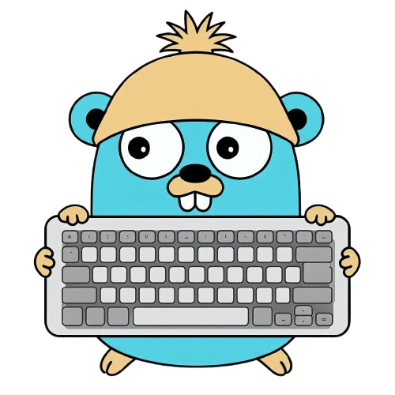

<h1 align="center">FingerGo</h1>



FingerGo is a **cross-platform touch-typing trainer**, designed to improve typing speed and accuracy, with a user-friendly and intuitive interface.  
It includes real-time keyboard visualization, a hierarchical text and code library, and live statistics tracking.  
Built with Go ↔ Wails ↔ Vanilla JavaScript (ES6+). Available for **Linux, macOS, and Windows**.

### Features
▸ **Clean Interface Design**

▸ **Shortcuts, Zen Mode, keyboard/Stat Toggle** 

▸ **Real-time visual keyboard with finger mapping**  

▸ **Hierarchical text/code library (plain text and code samples)**  

▸ **Live stats: WPM, CPM, accuracy, per‑key mistakes**  

▸ **Eye-friendly Dark/Light themes**

▸ **Customizable color theme**

## Installation

### 🪟 Windows [Release](https://github.com/AshBuk/FingerGo/releases/latest)

**Portable:**
1. Download `FingerGo-{VERSION}-x64-portable.zip`
2. Extract and run `FingerGo.exe`

**Requirements:** Windows 10/11 with WebView2 (auto-downloads if missing)

### 🍎 macOS [Release](https://github.com/AshBuk/FingerGo/releases/latest)

**DMG:**
1. Download `FingerGo-{VERSION}-universal.dmg`
2. Open DMG and drag FingerGo to Applications
3. **First launch:** Right-click → Open (bypasses Gatekeeper if unsigned)

**Supports:** Intel and Apple Silicon (Universal binary)

### 🐧 Linux [Releases](https://github.com/AshBuk/FingerGo/releases/latest)

**Flatpak:**
```bash
flatpak install --user FingerGo-{VERSION}-x86_64.flatpak
flatpak run com.ashbuk.FingerGo
```

**Portable (tar.gz):**
```bash
# Requires WebKit2GTK 4.1 installed on your system.
tar -xzf FingerGo-{VERSION}-linux-x86_64.tar.gz
./FingerGo
```

---

## Tech Stack

```
┌──────────────────────┐                    ┌────────────────────────┐
│   GUI LAYER          │◄──── Wails ───────►│  INTERNAL LAYER        │
│   HTML/CSS/JS        │      Bridge        │  Go 1.25+              │
└──────────────────────┘                    └────────────────────────┘
         │                                              │
    Event-Driven                                   Repository
         │                                              │
    ┌────┴─────┐                                   ┌────┴─────┐
    │ EventBus │                                   │ Repos    │
    │ (pub/sub)│                                   │ (DI)     │
    └────┬─────┘                                   └────┬─────┘
         │                                              │
    Modular JS                                    Domain Models
                                                         │
                                                         ▼
                                           ┌─────────────────────┐
                                           │ JSON Storage        │
                                           │ ~/.local/share/...  │
                                           └─────────────────────┘
```

- **Backend:** [Go](https://github.com/golang/go) 1.25+ with Repository Pattern (DI)
- **Bridge:** [Wails v2](https://github.com/wailsapp/wails) provides Go↔JS communication
- **Frontend:** Vanilla [JavaScript](https://github.com/tc39/ecma262) (ES6+) with Event-Driven Architecture (pub/sub EventBus)
- **Storage:** JSON files in XDG directories
- **Platforms:** [Linux](https://kernel.org/), [macOS](https://www.apple.com/macos/), [Windows](https://www.microsoft.com/windows/)

## For Developers

- [Technical design](docs/tech-design/)
- [Architecture overview](docs/tech-design/architecture.md)
- [Makefile](Makefile)
- [Contributing](docs/CONTRIBUTING.md)

## Acknowledgments
- [ATTRIBUTION.md](docs/ATTRIBUTION.md)
- [Wails](https://wails.io/)

## Apache 2.0 [LICENSE](LICENSE)

If you use this project, please link back to this repo and ⭐ it if it helped you.

## Sponsor

[](https://github.com/sponsors/AshBuk) [](https://www.paypal.com/donate/?hosted_button_id=R3HZH8DX7SCJG)

Please consider supporting development
